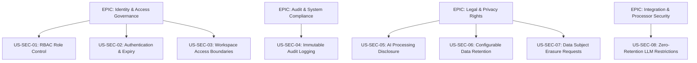

# ADMIN, SECURITY, LEGAL & PRIVACY ELICITATION FINDINGS & REQUIREMENTS SPECIFICATION
**Project:** AI-Powered Meeting-to-Action Converter  
**Course:** IT314 - Software Engineering  
**Module:** Admin Controls, Workspace Security, Legal Compliance & Data Privacy  

---

> [!IMPORTANT]
> Because this system ingests confidential corporate audio, meeting transcripts, participant identities, and action item commitments, robust administrative controls, multi-tier security policies, and strict data privacy compliance (GDPR/DPDP) are mandatory to protect corporate intellectual property and individual data rights.

---

## 1. Scope & Overview
The **Admin, Security, Legal & Privacy** specification establishes the governance architecture for the AI-Powered Meeting-to-Action Converter. It defines how the platform authenticates identities, isolates multi-tenant workspaces, encrypts meeting data at rest and in transit, enforces legal consent, handles third-party AI processing restrictions, and manages data retention and data subject rights.

This document formalizes the elicitation findings into an actionable Software Requirements Specification (SRS) subset, containing:
* Stakeholder Analysis & Elicitation Methodology
* Categorized System Requirements (Functional, Non-Functional, Data, and Domain)
* Product Backlog User Stories formatted with **Front of Card / Back of Card (Given-When-Then)** Acceptance Criteria
* **INVEST Validation** Matrix
* **MoSCoW Prioritization** and Mermaid EPIC Mapping
* **Requirement Conflict Identification & Resolution Log**

---

## 2. Stakeholders & Elicitation Methodology

| Stakeholder Role | Applied Elicitation Technique | Justification & Objectives |
| :--- | :--- | :--- |
| **Workspace Administrators** | **Semi-Structured Interviews** | Understand domain management, user onboarding/offboarding, role assignment, and workspace isolation needs. |
| **IT & Security Administrators** | **Security Audit & API Analysis** | Evaluate SSO (OAuth 2.0/OIDC), MFA requirements, token revocation, rate limiting, and immutable logging. |
| **Legal Officer / DPO** | **Document & Compliance Analysis** | Define legal consent policies, PII minimization, third-party LLM data processor restrictions, and data retention rules. |
| **External Participants / Guests** | **Survey & Use-Case Modeling** | Establish privacy disclosure requirements for non-employees participating in recorded or transcribed meetings. |
| **People Named in Meetings** | **Domain Constraint Modeling** | Address privacy protection and redaction requirements for non-attendees mentioned during verbal discussions. |

---

## 3. Key Elicitation Findings & Domain Focus Areas

### 3.1 Authentication & Identity Governance
* **Mandatory Authentication:** Unauthenticated access to meeting records, transcripts, summaries, or tasks must be strictly prevented.
* **SSO & OAuth 2.0:** Enterprise workspaces require Single Sign-On (Google Workspace, Microsoft Entra ID, Okta) integration.
* **Session Expiry:** Active sessions must automatically expire after a configurable inactivity threshold (e.g., 30 minutes) to prevent unauthorized endpoint access.

### 3.2 Role-Based Access Control (RBAC) & Multi-Tenant Isolation
* **Granular Permissions:** The system must enforce distinct access permissions for **Workspace Admin, Team Lead, Member, and External Guest**.
* **Tenant Data Boundary:** Workspace data must be strictly isolated at the database query level; users from Workspace A must never access data from Workspace B.

### 3.3 Meeting Data Protection & Cryptography
* **In-Transit Encryption:** All network communication (HTTPS, WebSockets) must enforce TLS 1.3.
* **At-Rest Encryption:** Audio files, transcripts, meeting summaries, and database backups must be encrypted using AES-256.
* **API Key Vault:** GenAI keys (OpenAI, Anthropic, Gemini) and integration OAuth tokens must be stored in encrypted secret managers.

### 3.4 Legal, Privacy & Transparency (Consent & Disclosure)
* **Recording & AI Disclosure:** Meeting participants must receive explicit notice prior to AI transcription or summary processing.
* **Consent Logging:** Participant consent state (Opt-in/Opt-out) must be recorded for legal auditability.
* **PII Redaction:** The system must provide mechanisms to redact unnecessary personally identifiable information (PII) before external AI processing.

### 3.5 Data Retention & Right-to-be-Forgotten Deletion
* **Configurable Retention Windows:** Workspaces must be able to configure retention windows (e.g., 90 days, 1 year) after which raw transcripts and audio are auto-purged.
* **Right-to-be-Forgotten:** Systems must support Data Subject Access Requests (DSAR) to erase or correct personal data associated with a specific user.

### 3.6 Approved Third-Party AI Data Processors
* **Zero Data Retention Mandate:** External AI/LLM API calls must be restricted strictly to enterprise endpoints that guarantee zero data retention (no model training on customer data).

---

## 4. System Requirements

### 4.1 Functional Requirements (FR)

* **FR-SEC-01 – Mandatory User Authentication:** The system shall authenticate user credentials or SSO tokens before granting access to workspaces, meetings, transcripts, or task boards.
* **FR-SEC-02 – Granular RBAC Enforcement:** The system shall restrict user actions based on assigned roles (`Workspace Admin`, `Team Lead`, `Member`, `Guest`).
* **FR-SEC-03 – Member Provisioning & Offboarding:** The system shall allow Workspace Admins to invite, modify roles, and immediately deactivate workspace users.
* **FR-SEC-04 – Resource Access Authorization:** The system shall enforce resource-level authorization checks on all meeting recordings, transcripts, summaries, and action items.
* **FR-SEC-05 – Task Lifecycle Authorization:** The system shall verify user permissions before allowing task creation, modification, status update, or deletion.
* **FR-SEC-06 – Secure Password Recovery:** The system shall provide secure time-limited token-based password reset flows when local credentials are used.
* **FR-SEC-07 – Enterprise SSO Integration:** The system shall support Single Sign-On (SSO) via OAuth 2.0 / SAML 2.0 protocols for enterprise tenants.
* **FR-SEC-08 – Comprehensive Audit Logging:** The system shall record immutable logs for authentication events, role changes, transcript access, integration toggles, and deletion requests.
* **FR-SEC-09 – Transcription & AI Processing Disclosure:** The system shall display automated privacy notifications when a meeting transcript is submitted for AI processing.
* **FR-SEC-10 – Consent Capture & Management:** The system shall record participant consent status prior to initiating meeting recording or transcription.
* **FR-SEC-11 – Configurable Data Retention Rules:** The system shall allow Workspace Admins to define custom retention periods for raw audio, transcripts, and summaries.
* **FR-SEC-12 – Permanent Data Deletion Execution:** The system shall execute permanent, unrecoverable erasure of transcripts and derived metadata upon manual request or retention expiry.
* **FR-SEC-13 – Data Subject Right Management (DSAR):** The system shall provide tools for Workspace Admins to execute data access, correction, and deletion requests.
* **FR-SEC-14 – External Participant Privacy Boundaries:** The system shall restrict guest users to strictly read-only access for explicitly shared meeting artifacts.
* **FR-SEC-15 – Lineage Linkage Protection:** The system shall cryptographically link AI-generated action items, summaries, and decisions to their source meeting record.
* **FR-SEC-16 – Third-Party Processing Whitelist Enforcement:** The system shall block transcript data transfer to unapproved third-party APIs or unauthenticated webhooks.
* **FR-SEC-17 – Automated PII Redaction:** The system shall support automatic pattern-based masking of sensitive data (SSNs, credit cards, passwords) prior to external LLM dispatch.

---

### 4.2 Non-Functional Requirements (NFR)

* **NFR-SEC-01 – Cryptographic Protection:** User credentials, refresh tokens, and GenAI API keys must be protected using salted bcrypt/Argon2id and AES-256 encryption.
* **NFR-SEC-02 – End-to-End Confidentiality:** Meeting transcripts and derived action items must be protected against unauthorized lateral cross-tenant access.
* **NFR-SEC-03 – Transport Layer Security:** All API traffic, database connections, and external webhook dispatches must enforce TLS 1.3 encryption.
* **NFR-SEC-04 – Session Token Hardening:** JWT tokens must use strong cryptographic signatures (RS256/ES256), short expiration windows (max 1 hour), and immediate server-side revocation lists.
* **NFR-SEC-05 – Data Minimization Standard:** The system shall collect and retain only the minimal personal data required to perform meeting action-item extraction.
* **NFR-SEC-06 – Regulatory Compliance Alignment:** System data workflows must comply with GDPR, CCPA, and DPDP regulatory requirements.
* **NFR-SEC-07 – Strict Retention Enforcement:** Expired meeting data must be purged from active databases and secondary storage within 24 hours of retention period expiration.
* **NFR-SEC-08 – Privacy Policy Transparency:** Data processing disclosures must be clearly accessible within the application UI at all times.
* **NFR-SEC-09 – Tamper-Proof Audit Trail:** Audit logs must be append-only, read-only, stored separately from workspace operational databases, and retained for 365 days.
* **NFR-SEC-10 – Secure Integration Vault:** Third-party OAuth tokens (Slack, Notion, WhatsApp) must be encrypted using dedicated key management services (KMS).
* **NFR-SEC-11 – Authentication High Availability:** The core authentication gateway shall maintain 99.9% uptime during operational business hours.
* **NFR-SEC-12 – Low-Latency Authorization Checks:** RBAC permission checks on API calls shall add no more than 15ms overhead to request latency.

---

### 4.3 Data Requirements (DR)

* **DR-SEC-01 – Identity Credentials Schema:** `UserID`, `Email`, `PasswordHash`, `Salt`, `SSOProvider`, `MFAEnabled`, `LastLoginAt`.
* **DR-SEC-02 – User-Role-Workspace Mapping Schema:** `MappingID`, `UserID`, `WorkspaceID`, `Role` (Admin, Lead, Member, Guest), `AssignedAt`.
* **DR-SEC-03 – Resource Access Control List (ACL):** `ResourceID`, `ResourceType` (Meeting, Transcript, Task), `WorkspaceID`, `AllowedRoles`, `IsPublicGuestAccessible`.
* **DR-SEC-04 – Privacy Consent Record Schema:** `ConsentID`, `MeetingID`, `ParticipantEmail`, `ConsentType`, `Status` (Granted/Denied), `Timestamp`, `IPAddress`.
* **DR-SEC-05 – Security Audit Log Schema:** `LogID`, `Timestamp`, `ActorID`, `ActionType` (LOGIN, ROLE_CHANGE, TRANSCRIPT_DELETE, TOKEN_REVOKE), `TargetResource`, `ClientIP`, `Status`.
* **DR-SEC-06 – Retention & Erasure Policy Schema:** `PolicyID`, `WorkspaceID`, `TranscriptRetentionDays`, `AudioRetentionDays`, `AutoPurgeEnabled`.
* **DR-SEC-07 – External Processor Data Transfer Log:** `TransferID`, `MeetingID`, `ProcessorName` (OpenAI, Anthropic), `PayloadHash`, `DataRetentionAgreementVerified`, `DispatchedAt`.

---

### 4.4 Domain Requirements

* **Domain Req-SEC-01 – Single Account Ownership:** A workspace must always maintain at least one active `Workspace Admin` account; an admin cannot self-delete if they are the sole administrator.
* **Domain Req-SEC-02 – Non-Participant Data Processing Boundary:** PII of non-participants mentioned during meetings must be treated as third-party data subject to redaction policies upon request.
* **Domain Req-SEC-03 – Zero LLM Model Training Rule:** Contracts and API parameters with external LLM providers must mandate zero retention and prohibit using customer transcript data for model retraining.
* **Domain Req-SEC-04 – Immediate Session Revocation:** Changing a user's role or deactivating their account must instantly invalidate all active JWT refresh tokens and active WebSocket sessions.

---

## 5. User Stories & Acceptance Criteria (Product Backlog)

### Epic 1: Identity & Access Management (IAM & RBAC)

#### US-SEC-01 – Manage Workspace Users & Roles
* **Front of Card:**  
  **As a** Workspace Administrator,  
  **I want to** add users and assign roles (Admin, Lead, Member, Guest),  
  **So that** workspace settings and meeting data remain accessible only to authorized personnel.
* **Back of Card (Acceptance Criteria):**
  ```gherkin
  Scenario: Modifying a user role
    Given an Admin is on the Workspace Settings page
    When the Admin changes a user's role from "Member" to "Workspace Admin"
    Then the system updates the permission mapping immediately
    And records an audit log entry with timestamp and Admin ID

  Scenario: Preventing unauthorized role modification
    Given a non-admin user attempts to POST to the role configuration API
    When the server evaluates the request authorization
    Then the server rejects the request with HTTP 403 Forbidden
  ```

#### US-SEC-02 – Secure User Authentication & Session Expiry
* **Front of Card:**  
  **As a** System User,  
  **I want to** authenticate securely using credentials or SSO with automatic session expiry,  
  **So that** my account and workspace meeting data are protected from unauthorized access.
* **Back of Card (Acceptance Criteria):**
  ```gherkin
  Scenario: Successful Login via Credentials or SSO
    Given a user provides valid email/password or verified OAuth SSO token
    When authentication completes
    Then the system issues a short-lived signed JWT session token (1 hour expiry)
    
  Scenario: Session Inactivity Expiry
    Given a user session has been inactive for 30 minutes
    When the user attempts a new API operation
    Then the session expires automatically and redirects the user to the Login screen
  ```

#### US-SEC-03 – Transcript & Task Access Control
* **Front of Card:**  
  **As a** Workspace Administrator,  
  **I want to** enforce strict access rules on meeting transcripts and tasks,  
  **So that** confidential discussion points are not exposed across team boundaries.
* **Back of Card (Acceptance Criteria):**
  ```gherkin
  Scenario: Cross-workspace access attempt blocked
    Given a user belonging exclusively to Workspace A
    When they attempt to access a transcript URL belonging to Workspace B
    Then the system denies access with HTTP 404 Not Found / 403 Forbidden
  ```

---

### Epic 2: Audit Logging & System Compliance

#### US-SEC-04 – Audit Log Recording & Review
* **Front of Card:**  
  **As an** IT / Security Administrator,  
  **I want** all administrative, authentication, and deletion activities logged,  
  **So that** unauthorized access attempts and security changes can be investigated.
* **Back of Card (Acceptance Criteria):**
  ```gherkin
  Scenario: Immutable audit logging on transcript deletion
    Given an authorized Admin deletes a meeting transcript
    When deletion executes
    Then an audit record is created storing ActorID, Timestamp, IPAddress, and ResourceID
    And the log entry cannot be edited or deleted by any user role
  ```

---

### Epic 3: Legal, Privacy & Data Subject Rights

#### US-SEC-05 – Participant Recording & AI Processing Notice
* **Front of Card:**  
  **As a** Meeting Participant,  
  **I want to** be notified when a meeting is transcribed or processed by AI,  
  **So that** I understand how my spoken data and personal information are used.
* **Back of Card (Acceptance Criteria):**
  ```gherkin
  Scenario: AI processing disclosure display
    Given a user uploads or pastes a transcript for AI action-item extraction
    When opening the meeting input view
    Then the system displays a visible disclosure banner stating "Transcripts are processed by enterprise AI under strict privacy controls"
  ```

#### US-SEC-06 – Configurable Data Retention & Automated Purge
* **Front of Card:**  
  **As a** Workspace Administrator,  
  **I want to** configure automated retention and deletion rules,  
  **So that** raw transcripts and recordings are not stored indefinitely.
* **Back of Card (Acceptance Criteria):**
  ```gherkin
  Scenario: Automated retention purge
    Given a workspace configured with a 90-day retention window
    When a transcript reaches 91 days of age
    Then the automated background cleanup job permanently erases the transcript and audio file
    And logs a compliance deletion event
  ```

#### US-SEC-07 – Handle Data Subject Access & Erasure Requests (DSAR)
* **Front of Card:**  
  **As a** Data Subject / User,  
  **I want to** submit access or erasure requests for my personal data,  
  **So that** I can exercise my statutory privacy rights (GDPR/DPDP).
* **Back of Card (Acceptance Criteria):**
  ```gherkin
  Scenario: Executing right-to-be-forgotten request
    Given a valid data erasure request approved by the Workspace Admin
    When the admin triggers user erasure
    Then the system redacts the user's PII from historical meeting metadata
    And reassigns their pending tasks to an unassigned status pool
  ```

---

### Epic 4: Integration Security & Processor Restrictions

#### US-SEC-08 – Restrict External AI Data Processors
* **Front of Card:**  
  **As a** Workspace Administrator,  
  **I want to** ensure meeting data is dispatched only to approved AI providers with zero data retention,  
  **So that** corporate meeting data is not used for external AI model training.
* **Back of Card (Acceptance Criteria):**
  ```gherkin
  Scenario: Dispatching LLM requests to approved vendor
    Given an AI extraction request
    When the system formats the payload for LLM processing
    Then it attaches the mandatory zero-retention API headers
    And verifies the destination endpoint against the approved vendor whitelist
  ```

---

## 6. INVEST Check Matrix

Every Security, Legal & Privacy User Story has been validated against the **INVEST** framework:

| User Story ID | Independent | Negotiable | Valuable | Estimable | Small | Testable | Pass/Fail |
| :--- | :---: | :---: | :---: | :---: | :---: | :---: | :---: |
| **US-SEC-01** (Role Management) | ✅ | ✅ | ✅ | ✅ | ✅ | ✅ | **PASS** |
| **US-SEC-02** (Authentication/SSO) | ✅ | ✅ | ✅ | ✅ | ✅ | ✅ | **PASS** |
| **US-SEC-03** (Transcript Access) | ✅ | ✅ | ✅ | ✅ | ✅ | ✅ | **PASS** |
| **US-SEC-04** (Audit Logging) | ✅ | ✅ | ✅ | ✅ | ✅ | ✅ | **PASS** |
| **US-SEC-05** (Privacy Notice) | ✅ | ✅ | ✅ | ✅ | ✅ | ✅ | **PASS** |
| **US-SEC-06** (Retention & Purge) | ✅ | ✅ | ✅ | ✅ | ✅ | ✅ | **PASS** |
| **US-SEC-07** (DSAR / Erasure) | ✅ | ✅ | ✅ | ✅ | ✅ | ✅ | **PASS** |
| **US-SEC-08** (AI Processor Whitelist)| ✅ | ✅ | ✅ | ✅ | ✅ | ✅ | **PASS** |

---

## 7. Product Backlog & MoSCoW Prioritization

### 7.1 MoSCoW Categorization

```
┌───────────────────────────────────────────────────────────────────────────┐
│                           MUST HAVE (Sprint 1 MVP)                        │
├───────────────────────────────────────────────────────────────────────────┤
│ • US-SEC-01: Workspace RBAC & Role Management (Admin, Member)            │
│ • US-SEC-02: Mandatory User Authentication & JWT Session Expiry            │
│ • US-SEC-03: Transcript & Task Access Isolation                           │
│ • US-SEC-08: Restrict LLM Data Transfer to Approved Zero-Retention APIs    │
└───────────────────────────────────────────────────────────────────────────┘
                                     │
                                     ▼
┌───────────────────────────────────────────────────────────────────────────┐
│                                SHOULD HAVE                                │
├───────────────────────────────────────────────────────────────────────────┤
│ • US-SEC-04: Immutable Audit Trail Logging (Login, Delete, Permission Edit)│
│ • US-SEC-05: AI Transcription Disclosure Banner                           │
│ • US-SEC-06: Configurable Data Retention & Automated Erasure              │
└───────────────────────────────────────────────────────────────────────────┘
                                     │
                                     ▼
┌───────────────────────────────────────────────────────────────────────────┐
│                                COULD HAVE                                 │
├───────────────────────────────────────────────────────────────────────────┤
│ • US-SEC-07: Automated DSAR Data Erasure Portal Workflow                   │
│ • Enterprise SSO / OAuth 2.0 (Google Workspace & Entra ID Integration)   │
└───────────────────────────────────────────────────────────────────────────┘
                                     │
                                     ▼
┌───────────────────────────────────────────────────────────────────────────┐
│                                WISH LIST                                  │
├───────────────────────────────────────────────────────────────────────────┤
│ • Automated AI PII Pattern Masking (SSN, Credit Card Auto-Redaction)      │
│ • Hardware Security Module (HSM) Key Management Vault                     │
└───────────────────────────────────────────────────────────────────────────┘
```

### 7.2 Mermaid Security Backlog Mapping



---

## 8. Requirement Conflict Identification & Resolution Log

| Conflict ID | Stakeholder A (Stance) | Stakeholder B (Stance) | Underlying Tension | Agreed Resolution & Trade-off |
| :--- | :--- | :--- | :--- | :--- |
| **CR-SEC-01** | **Product / Users:** Want instant zero-friction transcript processing without preliminary prompts. | **Legal / DPO:** Requires explicit recording and AI processing disclosures for privacy compliance. | Frictionless UX vs. Legal Transparency | **Persistent Notification Banner:** A non-blocking disclosure banner is rendered at the top of transcript input screens; no modal click required. |
| **CR-SEC-02** | **Security Audit Team:** Demands 7-year permanent audit log retention for investigation. | **Privacy / Compliance:** Demands right-to-be-forgotten PII deletion across all system storage. | Auditability vs. PII Erasure Mandate | **Pseudonymization:** Audit logs retain action events and timestamps but anonymize user PII (replacing names with hashed user tokens `USER_HASH_X`). |
| **CR-SEC-03** | **Engineering:** Prefers using standard public cloud LLM endpoints for rapid feature deployment. | **Enterprise Security:** Refuses LLM processing unless zero-retention SLAs and encrypted transit are guaranteed. | Development Speed vs. IP Confidentiality | **Enterprise API Subscriptions:** System connects strictly to commercial enterprise LLM endpoints bound by non-retention enterprise agreements. |

---

## 9. Open Questions for IT, Security & Legal Stakeholders

1. **SSO Provider Mandate:** Is Single Sign-On (Google / Microsoft Entra ID) required for MVP Sprint 1, or can basic JWT email/password authentication serve as the initial release target?
2. **Audit Log Retention Window:** What is the legal requirement for log retention (e.g., 90 days vs. 365 days) before archiving?
3. **MFA Scope:** Should Multi-Factor Authentication (MFA) be enforced for all users or strictly reserved for `Workspace Admin` accounts?

---

## 10. Security & Privacy Protection Lifecycle Formula

Data security and legal compliance govern every phase of the meeting ingestion and task management value chain:

$$\text{User Authentication} \xrightarrow{\text{RBAC Authorization}} \text{Encrypted Transit (TLS 1.3)} \xrightarrow{\text{Zero-Retention LLM Processing}} \text{Audit Logging} \xrightarrow{\text{Retention Purge}}$$

---
*This document provides the refined Admin, Security, Legal & Privacy Requirements for integration into the SE Project Backlog and Sprint 1 Planning.*
