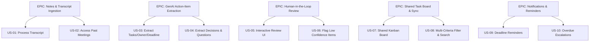

# SURVEY FORM ELICITATION FINDINGS & REQUIREMENTS SPECIFICATION
**Project:** AI-Powered Meeting-to-Action Converter  
**Course:** IT314 - Software Engineering  
**Elicitation Technique:** Quantitative & Qualitative Survey Questionnaire  

---

> [!NOTE]
> The findings and requirements documented herein stem from the broad stakeholder survey conducted during the initial requirements elicitation phase. They serve as primary user-level inputs and are validated alongside semi-structured interviews, observational workflow analyses, and throw-away prototyping.

---

## 1. Scope & Overview
The **Survey / Form-Based Elicitation** phase captured user pain points, workflow fragmentation, and feature expectations from end-users across diverse organizational roles (Meeting Organizers, Project Managers, Team Members, Chasers, and Absentees). 

The primary problem identified is not merely note-taking during meetings, but the severe breakdown in **converting verbal meeting discussions into clearly assigned, trackable, and verifiable action items**.

This document formalizes the survey raw data into a complete Software Requirements Specification (SRS) subset, detailing:
* Quantitative and qualitative survey insights
* Categorized Requirements (Functional, Non-Functional, Data, and Domain)
* Product Backlog User Stories formatted with **Front of Card / Back of Card (Given-When-Then)** Acceptance Criteria
* **INVEST Validation** matrix
* **MoSCoW Prioritization** and Mermaid EPIC Mapping
* **Conflict Identification & Resolution Log**

---

## 2. Stakeholders & Elicitation Methodology

| Stakeholder Role | Applied Elicitation Technique | Justification & Objectives |
| :--- | :--- | :--- |
| **Meeting Organizers / Chairs** | **Structured Survey Questionnaire** | Understand administrative overhead in manual meeting summary creation and task allocation. |
| **Project Managers / Team Leads** | **Survey + Workflow Analysis** | Capture requirements around task ownership, deadline enforcement, priority tracking, and board sync. |
| **Team Members / Assignees** | **Anonymous Form Responses** | Identify pain points regarding missed commitments, unclear task scope, and preferred reminder channels. |
| **Chasers / Meeting Note-Takers** | **Qualitative Open-Ended Form** | Gauge the burden of manual follow-ups and lost context in group chat threads (WhatsApp/Slack). |
| **Meeting Absentees** | **Feature Ranking Survey** | Evaluate demand for automated meeting summaries, key decision logs, and searchable discussion points. |

---

## 3. Detailed Survey Findings & Analysis

### 3.1 Current Task Management Fragmentation
Survey respondents reported managing meeting outcomes across a fragmented ecosystem: **WhatsApp, Notion, Slack, Google Docs, Google Sheets, and physical notebooks**. 
* **Insight:** There is zero single-source-of-truth. Tasks generated in meetings are manually transcribed into disparate tools, causing data loss and friction.
* **Requirement Need:** A centralized task management repository linked directly to meeting audio/transcripts.

### 3.2 Task Decay & Follow-up Failures
A majority of respondents reported that action items are frequently **forgotten or buried in chat threads**.
* **Insight:** Follow-ups currently rely on manual "chasing" by managers or note-takers.
* **Requirement Need:** Centralized task status tracking combined with automated multi-channel reminders.

### 3.3 Mandatory Task Attributes
Unclear task scope and vague deadlines were cited as the leading causes of project delay.
* **Insight:** Survey participants unanimously agreed that every valid task must explicitly contain five attributes:
  1. **Task Description** (Clear actionable verb-noun phrase)
  2. **Owner / Assignee** (Single point of accountability)
  3. **Deadline** (Normalized date/time target)
  4. **Priority** (High, Medium, Low)
  5. **Status** (To Do, In Progress, Blocked, Completed)

### 3.4 AI Task Extraction & Human-in-the-Loop Review
Respondents overwhelmingly welcomed GenAI task extraction, but strongly rejected full auto-pilot creation without human oversight.
* **Insight:** Users require a **Human-in-the-Loop (HITL)** safety net. When AI confidence is low or information is ambiguous, items must be flagged as **"Needs Review"** for manual verification.
* **Requirement Need:** A dedicated review screen allowing users to **Approve, Edit, or Reject** AI suggestions.

### 3.5 Reminder Channel Preferences
Survey feedback highlighted distinct notification preferences depending on role urgency:
* **High Urgency / Overdue:** WhatsApp & In-App Notifications
* **Standard Reminders:** Email, Slack, Microsoft Teams

---

## 4. System Requirements

### 4.1 Functional Requirements (FR)

* **FR-01 – Meeting Transcript Input:** The system shall accept recorded or live meeting transcripts (plain text, JSON, or transcript file upload).
* **FR-02 – Meeting Record Creation:** The system shall create a unique meeting record containing metadata (title, date, participants) and link it to the uploaded transcript.
* **FR-03 – AI Action-Item Extraction:** The system shall automatically scan transcripts to extract actionable task items separate from general conversation.
* **FR-04 – Task Owner Identification:** The system shall parse transcripts to identify and link the designated task owner to a registered user.
* **FR-05 – Deadline Identification:** The system shall detect explicit and relative date/time statements in the transcript and normalize them into calendar deadlines.
* **FR-06 – Priority Identification:** The system shall detect priority statements or infer task priority based on urgency keywords in the discussion.
* **FR-07 – Decision Extraction:** The system shall identify key organizational decisions made during the meeting and store them separately from action items.
* **FR-08 – Pending Question Identification:** The system shall extract unresolved questions or open topics requiring post-meeting clarification.
* **FR-09 – Discussion Point Summarization:** The system shall extract key discussion topics to provide context for extracted tasks.
* **FR-10 – AI Confidence & Uncertainty Detection:** The system shall compute extraction confidence and mark items falling below a configurable threshold as **"Needs Review"**.
* **FR-11 – Human Review Interface:** The system shall provide an interactive review UI where organizers/users can inspect AI-generated suggestions.
* **FR-12 – Task Approval & Confirmation:** The system shall allow users to explicitly approve an extracted suggestion, converting it into a confirmed task.
* **FR-13 – Task Owner Modification:** The system shall allow authorized users to edit or reassign the owner of any task during or post-review.
* **FR-14 – Deadline Modification:** The system shall allow users to edit or confirm task deadlines.
* **FR-15 – Priority Modification:** The system shall allow users to manually override AI-assigned priority levels.
* **FR-16 – Shared Task Board:** The system shall maintain a centralized Kanban/list task board displaying all confirmed meeting tasks.
* **FR-17 – Task Status Management:** The system shall support status transitions: `To Do`, `In Progress`, `Blocked`, `Completed`.
* **FR-18 – Progress Tracking Dashboard:** The system shall provide visual metrics on team task completion, pending items, and overdue tasks.
* **FR-19 – Multi-Criteria Search & Filter:** The system shall enable users to filter tasks by meeting, assignee, priority, deadline range, and status.
* **FR-20 – Upcoming Deadline Reminders:** The system shall automatically issue notifications X hours/days prior to task due dates.
* **FR-21 – Overdue Task Escalation:** The system shall trigger overdue notifications to assignees and organizers when deadlines pass without completion.
* **FR-22 – Multi-Channel Notification Dispatch:** The system shall dispatch reminders via in-app alerts, email, and configured webhooks (Slack, WhatsApp, Teams).
* **FR-23 – Automated Meeting Summary Generation:** The system shall generate a structured meeting summary combining decisions, key discussions, and action items.
* **FR-24 – Transcript Context Viewing:** The system shall allow users to view the original transcript text associated with any meeting record.
* **FR-25 – Source-Text Explainability:** The system shall display the exact transcript snippet that triggered a specific AI task extraction.
* **FR-26 – External Workspace Synchronization:** The system shall export confirmed tasks to external productivity tools (Notion, Jira, Linear) via standard APIs.

---

### 4.2 Non-Functional Requirements (NFR)

* **NFR-01 – Performance Latency:** The AI processing engine shall process a standard 30-minute transcript (approx. 5,000 words) and generate actionable suggestions within 15 seconds.
* **NFR-02 – Extraction Accuracy:** The AI model shall achieve a minimum 85% precision rate in distinguishing actionable tasks from general discussion points.
* **NFR-03 – System Availability:** The task board and notification engine shall maintain 99.5% uptime during operational hours.
* **NFR-04 – Data Integrity:** The system shall enforce referential integrity between meeting records, transcript snippets, and generated tasks, preventing orphan tasks.
* **NFR-05 – Human-in-the-Loop Safety:** The system shall strictly prevent unconfirmed AI task suggestions with confidence < 0.70 from appearing on the public workspace board.
* **NFR-06 – Data Privacy & Encryption:** Transcripts, meeting summaries, and task descriptions must be encrypted at rest (AES-256) and in transit (TLS 1.3).
* **NFR-07 – Usability & Efficiency:** A meeting organizer shall be able to review, edit, and approve a batch of 10 AI-generated tasks in under 2 minutes.
* **NFR-08 – Scalability:** The backend task database shall support concurrent indexing and rendering for up to 50,000 active workspace tasks.
* **NFR-09 – Explainability:** Every AI-extracted task must store and expose its source text offset mapping for auditability.
* **NFR-10 – Interoperability:** External integration endpoints must adhere to RESTful standards and JSON payloads.

---

### 4.3 Data Requirements (DR)

* **DR-01 – Meeting Record Schema:** `MeetingID`, `Title`, `ScheduledTime`, `OrganizerID`, `TranscriptURL`, `Status`, `CreatedAt`.
* **DR-02 – Action Item Schema:** `TaskID`, `MeetingID`, `Description`, `AssigneeID`, `Deadline`, `Priority`, `Status`, `ConfidenceScore`, `SourceSnippet`, `ApprovedBy`, `ApprovedAt`.
* **DR-03 – Decision Record Schema:** `DecisionID`, `MeetingID`, `DecisionText`, `ImpactArea`, `SourceSnippet`.
* **DR-04 – Unresolved Question Schema:** `QuestionID`, `MeetingID`, `QuestionText`, `AssignedTo`, `ResolutionStatus`.
* **DR-05 – Audit Trail Log:** `LogID`, `TaskID`, `ModifiedBy`, `OldState`, `NewState`, `Timestamp`.

---

### 4.4 Domain Requirements

* **Domain Req-01 – Mandatory Ownership Rule:** A task cannot transition to `Confirmed` or `To Do` status without an assigned owner. Unassigned items must remain in `Needs Review`.
* **Domain Req-02 – Ambiguous Date Resolution:** Relative date terms (e.g., "by next Friday") must be computed using the meeting's recorded timestamp and time zone.
* **Domain Req-03 – Non-Actionable Exclusions:** Statements expressing intent without commitment (e.g., "We might look into this next year") shall not be classified as action items.
* **Domain Req-04 – Traceable Lineage:** Every confirmed task must retain an unbroken cryptographic reference link to its originating meeting ID.

---

## 5. User Stories & Acceptance Criteria (Product Backlog)

### Epic 1: Meeting & Transcript Ingestion

#### US-01 – Submit Transcript for Processing
* **Front of Card:**  
  **As a** Meeting Organizer,  
  **I want to** paste or upload a meeting transcript,  
  **So that** the system can process the discussion and extract action items.
* **Back of Card (Acceptance Criteria):**
  ```gherkin
  Scenario: Successfully submitting a text transcript
    Given the user is on the "Create Meeting" page
    When the user enters meeting metadata and pastes a non-empty transcript
    And clicks "Process Transcript"
    Then the system creates a unique Meeting Record
    And initiates AI background extraction within 2 seconds
    
  Scenario: Rejecting empty transcript submission
    Given the user is on the "Create Meeting" page
    When the user submits an empty transcript field
    Then the system displays an error message "Transcript content cannot be empty"
    And prevents form submission
  ```

#### US-02 – Access Historical Meetings
* **Front of Card:**  
  **As a** Team Member,  
  **I want to** view past meeting records,  
  **So that** I can review previous discussions, decisions, and tasks.
* **Back of Card (Acceptance Criteria):**
  ```gherkin
  Scenario: Viewing past meeting records
    Given an authenticated user is on the Meetings Dashboard
    When they select a specific meeting from the historical list
    Then the system displays the meeting summary, extracted decisions, and assigned tasks
    And provides access to the full transcript for authorized users
  ```

---

### Epic 2: AI Action-Item & Insight Extraction

#### US-03 – Extract Actionable Tasks with Owner & Deadline
* **Front of Card:**  
  **As a** Project Manager,  
  **I want** the AI to automatically identify task descriptions, assignees, and deadlines from the transcript,  
  **So that** I don't have to manually take detailed notes during meetings.
* **Back of Card (Acceptance Criteria):**
  ```gherkin
  Scenario: AI identifies task with owner and deadline
    Given a transcript containing "John will prepare the Q3 financial report by Friday 5 PM"
    When the AI extraction pipeline executes
    Then the system extracts Task: "Prepare Q3 financial report"
    And identifies Assignee: "John"
    And normalizes Deadline: "Coming Friday at 17:00"
    And tags the item status as "Needs Review"
  ```

#### US-04 – Extract Decisions & Unresolved Questions
* **Front of Card:**  
  **As a** Meeting Participant,  
  **I want** the AI to separate key decisions and open questions from action items,  
  **So that** organizational consensus and unresolved issues are clearly recorded.
* **Back of Card (Acceptance Criteria):**
  ```gherkin
  Scenario: Distinguishing decisions from action items
    Given a transcript stating "We agreed to adopt PostgreSQL for the database"
    When the AI processes the transcript
    Then it categorizes the statement as a "Decision"
    And places it in the Decision Log section rather than the Task Board
  ```

---

### Epic 3: Human-in-the-Loop Review & Validation

#### US-05 – Interactive Review UI for AI Suggestions
* **Front of Card:**  
  **As a** Meeting Organizer,  
  **I want to** review, edit, approve, or reject AI-extracted tasks on a dedicated review screen,  
  **So that** inaccurate or incomplete tasks are corrected before reaching the team board.
* **Back of Card (Acceptance Criteria):**
  ```gherkin
  Scenario: Approving an extracted task
    Given the organizer is on the Task Review screen
    When the organizer clicks "Approve" on an AI task suggestion
    Then the task status changes from "Needs Review" to "Confirmed"
    And the task is published to the Shared Task Board

  Scenario: Editing an extracted task before approval
    Given the organizer notices an incorrect deadline in an AI suggestion
    When the organizer edits the deadline field and clicks "Save & Approve"
    Then the task updates with the new deadline
    And is saved as a confirmed task
  ```

#### US-06 – Flag Low-Confidence & Ambiguous Tasks
* **Front of Card:**  
  **As a** Meeting Organizer,  
  **I want** low-confidence AI extractions to be highlighted as "Needs Review",  
  **So that** I am prompted to verify uncertain information.
* **Back of Card (Acceptance Criteria):**
  ```gherkin
  Scenario: Highlighting low confidence items
    Given an AI extraction with a confidence score below 0.70
    When rendered in the review UI
    Then the system displays a warning icon and "Low Confidence" badge
    And requires explicit manual confirmation before publishing
  ```

---

### Epic 4: Centralized Task Board & Status Tracking

#### US-07 – Centralized Shared Kanban Task Board
* **Front of Card:**  
  **As a** Team Member,  
  **I want** all confirmed meeting tasks displayed on a shared Kanban board,  
  **So that** team workload and task progress are transparent.
* **Back of Card (Acceptance Criteria):**
  ```gherkin
  Scenario: Moving task status across columns
    Given a confirmed task in the "To Do" column on the Kanban board
    When the assignee drags the card to "In Progress"
    Then the task status updates in real-time for all workspace members
    And an audit log entry is recorded
  ```

#### US-08 – Filter & Search Tasks
* **Front of Card:**  
  **As a** Team Lead,  
  **I want to** filter tasks by owner, priority, meeting, and deadline,  
  **So that** I can focus on critical pending items.
* **Back of Card (Acceptance Criteria):**
  ```gherkin
  Scenario: Filtering tasks by owner and priority
    Given the shared task board has 50 items
    When the user selects Filter -> Owner: "John" AND Priority: "High"
    Then the board renders only high-priority tasks assigned to John within 200ms
  ```

---

### Epic 5: Multi-Channel Notifications & Reminders

#### US-09 – Automated Deadline Reminders
* **Front of Card:**  
  **As a** Task Assignee,  
  **I want to** receive automated reminders before my task deadline expires,  
  **So that** I can complete my deliverables on time.
* **Back of Card (Acceptance Criteria):**
  ```gherkin
  Scenario: Triggering upcoming deadline reminder
    Given a task due in 24 hours
    When the system cron runner executes
    Then a notification is dispatched to the assignee's preferred channel (In-App / Email / WhatsApp)
    And contains the task name, deadline, and direct board link
  ```

#### US-10 – Overdue Task Escalation
* **Front of Card:**  
  **As a** Project Manager,  
  **I want** the system to alert me when a task becomes overdue,  
  **So that** I can follow up on blocked deliverables.
* **Back of Card (Acceptance Criteria):**
  ```gherkin
  Scenario: Task passes deadline without completion
    Given a task with status "In Progress" whose deadline has passed
    When the system updates task states
    Then the task is tagged with an "OVERDUE" badge
    And an escalation alert is sent to both assignee and organizer
  ```

---

### Epic 6: Summaries & Traceable Explanations

#### US-11 – Source-Text Context Mapping (Explainability)
* **Front of Card:**  
  **As a** User,  
  **I want to** click on a task and view the exact transcript snippet where it was discussed,  
  **So that** I can verify the context behind the assignment.
* **Back of Card (Acceptance Criteria):**
  ```gherkin
  Scenario: Viewing source snippet for a task
    Given a user inspecting a task card
    When they click "View Source Transcript"
    Then a modal opens highlighting the exact lines from the transcript where the task was uttered
  ```

---

## 6. INVEST Check Matrix

Every User Story in this backlog has been verified against the **INVEST** framework:

| User Story ID | Independent | Negotiable | Valuable | Estimable | Small | Testable | Pass/Fail |
| :--- | :---: | :---: | :---: | :---: | :---: | :---: | :---: |
| **US-01** (Submit Transcript) | ✅ | ✅ | ✅ | ✅ | ✅ | ✅ | **PASS** |
| **US-02** (Access Meetings) | ✅ | ✅ | ✅ | ✅ | ✅ | ✅ | **PASS** |
| **US-03** (AI Task Extraction) | ✅ | ✅ | ✅ | ✅ | ✅ | ✅ | **PASS** |
| **US-04** (Extract Decisions) | ✅ | ✅ | ✅ | ✅ | ✅ | ✅ | **PASS** |
| **US-05** (Human Review UI) | ✅ | ✅ | ✅ | ✅ | ✅ | ✅ | **PASS** |
| **US-06** (Flag Confidence) | ✅ | ✅ | ✅ | ✅ | ✅ | ✅ | **PASS** |
| **US-07** (Kanban Task Board) | ✅ | ✅ | ✅ | ✅ | ✅ | ✅ | **PASS** |
| **US-08** (Filter & Search) | ✅ | ✅ | ✅ | ✅ | ✅ | ✅ | **PASS** |
| **US-09** (Deadline Reminders)| ✅ | ✅ | ✅ | ✅ | ✅ | ✅ | **PASS** |
| **US-10** (Overdue Escalation) | ✅ | ✅ | ✅ | ✅ | ✅ | ✅ | **PASS** |
| **US-11** (Source Explainability)| ✅ | ✅ | ✅ | ✅ | ✅ | ✅ | **PASS** |

---

## 7. Product Backlog & MoSCoW Prioritization

### 7.1 MoSCoW Categorization

```
┌───────────────────────────────────────────────────────────────────────────┐
│                           MUST HAVE (Sprint 1 MVP)                        │
├───────────────────────────────────────────────────────────────────────────┤
│ • US-01: Submit & Paste Transcript                                       │
│ • US-03: AI Action-Item Extraction (Task, Owner, Deadline)               │
│ • US-05: Human Review Interface (Approve / Edit / Reject)                │
│ • US-07: Shared Task Board (Basic Kanban: To Do, In Progress, Done)        │
└───────────────────────────────────────────────────────────────────────────┘
                                     │
                                     ▼
┌───────────────────────────────────────────────────────────────────────────┐
│                                SHOULD HAVE                                │
├───────────────────────────────────────────────────────────────────────────┤
│ • US-04: Extract Decisions & Unresolved Questions                         │
│ • US-06: Confidence Score Flagging & "Needs Review" Badging               │
│ • US-08: Task Board Filtering & Searching                                 │
│ • US-09: Automated In-App / Email Deadline Reminders                      │
└───────────────────────────────────────────────────────────────────────────┘
                                     │
                                     ▼
┌───────────────────────────────────────────────────────────────────────────┐
│                                COULD HAVE                                 │
├───────────────────────────────────────────────────────────────────────────┤
│ • US-10: Overdue WhatsApp Escalation Dispatch                             │
│ • US-11: Source-Text Highlight & Transcript Context Modal                │
│ • US-22: Export Tasks to Notion / Jira API                                │
└───────────────────────────────────────────────────────────────────────────┘
                                     │
                                     ▼
┌───────────────────────────────────────────────────────────────────────────┐
│                                WISH LIST                                  │
├───────────────────────────────────────────────────────────────────────────┤
│ • Live Streaming Audio Transcription Engine Integration                    │
│ • Voice-Based Reminder Bot (WhatsApp Audio Notes)                         │
└───────────────────────────────────────────────────────────────────────────┘
```

### 7.2 Mermaid Backlog to EPIC Mapping



---

## 8. Requirement Conflict Identification & Resolution Log

| Conflict ID | Stakeholder A (Stance) | Stakeholder B (Stance) | Underlying Tension | Agreed Resolution & Trade-off |
| :--- | :--- | :--- | :--- | :--- |
| **CR-01** | **Team Members:** Want 100% automated task creation directly from meetings without extra review steps. | **Project Managers / Security:** Require mandatory human approval to avoid spam or incorrect task assignments. | Speed vs. Accuracy & Data Quality | **HITL Workflow:** AI suggestions with high confidence (>0.85) auto-queue for 1-click bulk approval; low confidence items require manual edit. |
| **CR-02** | **End Users:** Prefer instant WhatsApp reminders for all task updates. | **IT / Admin:** WhatsApp Business API incurs per-message costs and verification overhead. | User Convenience vs. Cost & API Limits | **Phased Dispatch:** Free channels (In-App & Email) used for standard reminders; WhatsApp reserved for critical overdue alerts in MVP. |
| **CR-03** | **Meeting Participants:** Often state relative deadlines ("finish by early next week"). | **System Engine:** Requires strict ISO date-time timestamps for database calendar sorting. | Natural Language Ambiguity vs. System Determinism | **Relative Date Parser + Review Confirmation:** System computes probable date (e.g. next Monday 09:00) and displays an editable date picker in the Review UI. |

---

## 9. Open Questions for Prototype Validation

1. **Review Layout Preference:** Do meeting organizers prefer reviewing extracted tasks in a **side-by-side split screen** (Transcript on Left, Task Cards on Right) or a **stepped modal wizard**?
2. **Bulk vs. Individual Approval:** Is 1-click "Approve All High-Confidence Items" preferred over approving task-by-task?
3. **Unassigned Task Handling:** Should unassigned tasks be placed in an "Unassigned Pool" on the board or held in "Needs Review" until an owner is named?

---

## 10. System Value Stream & Lifecycle Formula

The survey elicitation proves that value is realized only when raw unstructured conversational audio transforms into verified, executed deliverables:

$$\text{Raw Transcript} \xrightarrow{\text{GenAI Extraction}} \text{AI Suggestions} \xrightarrow{\text{Human Review UI}} \text{Confirmed Task} \xrightarrow{\text{Kanban Sync}} \text{Automated Reminders} \xrightarrow{\text{Execution}}$$

---
*This document provides the refined Survey Form Elicitation Requirements for integration into the SE Project Backlog and Sprint 1 Planning.*
