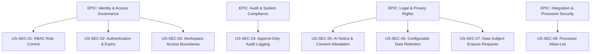

# ADMIN, SECURITY, LEGAL & PRIVACY ELICITATION FINDINGS & REQUIREMENTS SPECIFICATION
**Project:** AI-Powered Meeting-to-Action Converter  
**Course:** IT314 - Software Engineering  
**Module:** Admin Controls, Workspace Security, Legal Compliance & Data Privacy  

---

> [!IMPORTANT]
> Because this system ingests meeting transcripts, participant identities, and action item commitments, administrative controls, workspace isolation, and data privacy compliance (DPDP, with GDPR awareness for EU participants) are mandatory. All controls below are designed to run on the project's zero-budget stack (Supabase Free, Vercel Hobby, Render Free).

---

## 1. Scope & Overview
The **Admin, Security, Legal & Privacy** specification establishes the governance architecture for the AI-Powered Meeting-to-Action Converter. It defines how the platform authenticates identities, isolates multi-tenant workspaces, protects meeting data at rest and in transit (using platform-provided encryption), records consent, restricts third-party AI processing, and manages data retention and data subject rights.

This document formalizes the elicitation findings into an actionable Software Requirements Specification (SRS) subset, containing:
* Stakeholder Analysis & Elicitation Methodology
* Categorized System Requirements (Functional, Non-Functional, Data, and Domain)
* Product Backlog User Stories formatted with **Front of Card / Back of Card (Given-When-Then)** Acceptance Criteria
* **INVEST Validation** Matrix
* **MoSCoW Prioritization** and Mermaid EPIC Mapping
* **Requirement Conflict Identification & Resolution Log**

---

## 2. Stakeholders & Elicitation Methodology

| Stakeholder Role | Applied Elicitation Technique | Justification & Objectives |
| :--- | :--- | :--- |
| **Workspace Administrators** | **Semi-Structured Interviews** | Understand domain management, user onboarding/offboarding, role assignment, and workspace isolation needs. |
| **IT & Security Administrators** | **Security Audit & API Analysis** | Evaluate authentication options (OAuth 2.0/OIDC), MFA requirements, token lifetime, rate limiting, and audit logging. |
| **Legal Officer / DPO** | **Document & Compliance Analysis** | Define consent policies, PII minimization, third-party LLM data processor restrictions, and data retention rules. |
| **External Participants / Guests** | **Survey & Use-Case Modeling** | Establish privacy disclosure requirements for non-employees participating in transcribed meetings. |
| **People Named in Meetings** | **Domain Constraint Modeling** | Address privacy protection and redaction requirements for non-attendees mentioned during verbal discussions. |

> **Validation status:** The IT/Security and Legal/DPO interviews are still pending (see Notion Elicitation Plan). Items marked **(Assumption)** are working defaults until those interviews confirm or change them.

---

## 3. Key Elicitation Findings & Domain Focus Areas

### 3.1 Authentication & Identity Governance
* **Mandatory Authentication:** Unauthenticated access to meeting records, transcripts, summaries, or tasks must be strictly prevented.
* **Sign-In Methods:** Email/password, Magic Link, and Google OAuth through Supabase Auth (all free). Enterprise SAML SSO (Okta, Microsoft Entra ID) requires a paid Supabase plan and is deferred to post-MVP. **(Assumption)**
* **Session Expiry:** Sessions end after 30 minutes of inactivity via a client-side idle timer that calls `signOut()`; access tokens are short-lived (15 minutes). **(Assumption)**

### 3.2 Role-Based Access Control (RBAC) & Multi-Tenant Isolation
* **Granular Permissions:** The system must enforce distinct access permissions for **Workspace Admin, Organiser, and Member**. An External Guest role is deferred to post-MVP.
* **Tenant Data Boundary:** Workspace data must be strictly isolated at the database level using Postgres Row-Level Security (RLS); users from Workspace A must never access data from Workspace B.

### 3.3 Meeting Data Protection & Cryptography
* **In-Transit Encryption:** All traffic uses HTTPS only (TLS 1.2 or higher, managed by Vercel/Render/Supabase) with HSTS enabled.
* **At-Rest Encryption:** Transcripts, summaries, and database storage rely on Supabase's platform disk encryption (AES-256). No meeting audio is stored in the MVP.
* **Secrets Handling:** LLM API keys (Gemini, Sarvam) are server-side environment variables only; integration OAuth tokens are stored in Supabase Vault.

### 3.4 Legal, Privacy & Transparency (Consent & Disclosure)
* **AI Processing Disclosure:** A persistent banner on the transcript input screen explains that transcripts are processed by a third-party AI provider.
* **Consent Attestation:** Before submitting a transcript for AI processing, the organiser confirms (checkbox) that participants were informed; the attestation is logged for auditability.
* **PII Redaction:** Organisers can manually redact names or personal data during review. Automatic pattern-based masking is a Wish List item.

### 3.5 Data Retention & Right-to-be-Forgotten Deletion
* **Configurable Retention Windows:** Workspaces choose 30/90/180/365-day retention (default 90 days), after which transcripts are automatically purged by a daily `pg_cron` job.
* **Right-to-be-Forgotten:** The system supports Data Subject Access Requests (DSAR) to export, correct, or erase personal data associated with a specific user.

### 3.6 Third-Party AI Data Processors
* **Free-tier reality:** Free LLM tiers do not offer zero-retention contracts, and Gemini's free tier may use inputs to improve Google's products.
* **Controls:** Only synthetic or consented transcripts are sent to free tiers during development and demos; a processor inventory records each provider's retention and training policy; confidential meetings use No-AI mode. Zero-retention enterprise endpoints are a paid post-MVP upgrade.

---

## 4. System Requirements

### 4.1 Functional Requirements (FR)

* **FR-SEC-01 – Mandatory User Authentication:** The system shall authenticate user credentials, Magic Link tokens, or Google OAuth tokens before granting access to workspaces, meetings, transcripts, or task boards.
* **FR-SEC-02 – Granular RBAC Enforcement:** The system shall restrict user actions based on assigned roles (`Workspace Admin`, `Organiser`, `Member`), enforced with Postgres RLS.
* **FR-SEC-03 – Member Provisioning & Offboarding:** The system shall allow Workspace Admins to add members, modify roles, and immediately deactivate workspace users.
* **FR-SEC-04 – Resource Access Authorization:** The system shall enforce resource-level authorization checks on all meeting transcripts, summaries, and action items.
* **FR-SEC-05 – Task Lifecycle Authorization:** The system shall verify user permissions before allowing task creation, modification, status update, or deletion.
* **FR-SEC-06 – Secure Password Recovery:** The system shall provide time-limited, token-based password reset via Supabase Auth, delivered through the project's SMTP provider.
* **FR-SEC-07 – Social Sign-In:** The system shall support Google OAuth sign-in via Supabase Auth. Enterprise SAML 2.0 SSO is deferred to post-MVP (paid plan).
* **FR-SEC-08 – Comprehensive Audit Logging:** The system shall record append-only logs for authentication events, role changes, transcript access, approvals, integration toggles, and deletion requests.
* **FR-SEC-09 – Transcription & AI Processing Disclosure:** The system shall display a privacy notice when a meeting transcript is submitted for AI processing.
* **FR-SEC-10 – Consent Attestation:** The system shall record the organiser's attestation that participants were informed of AI processing before a transcript is submitted.
* **FR-SEC-11 – Configurable Data Retention Rules:** The system shall allow Workspace Admins to choose a retention period (30/90/180/365 days) for transcripts and summaries.
* **FR-SEC-12 – Permanent Data Deletion Execution:** The system shall permanently delete transcripts and derived metadata from the application database and file storage upon manual request or retention expiry. Provider-side logs outside the system's control are documented as a known limitation.
* **FR-SEC-13 – Data Subject Right Management (DSAR):** The system shall provide tools for Workspace Admins to execute data access, correction, and deletion requests.
* **FR-SEC-14 – External Participant Privacy Boundaries (Post-MVP):** The system shall restrict guest users to strictly read-only access for explicitly shared meeting artifacts.
* **FR-SEC-15 – Lineage Linkage Protection:** The system shall link every AI-generated action item, summary, and decision to its source meeting through a non-null foreign key and store the verbatim source excerpt.
* **FR-SEC-16 – Third-Party Processing Allow-List Enforcement:** The system shall send transcript data only to LLM providers listed in the server-side processor allow-list and never to unauthenticated webhooks.
* **FR-SEC-17 – PII Redaction:** The system shall let organisers manually redact names and personal data during review. Automatic pattern-based masking of Indian PII (Aadhaar, PAN, phone numbers, email addresses) before LLM dispatch is a Wish List item.

---

### 4.2 Non-Functional Requirements (NFR)

* **NFR-SEC-01 – Cryptographic Protection:** Password hashing is delegated to Supabase Auth (bcrypt); integration tokens are encrypted in Supabase Vault; API keys exist only as server-side environment variables.
* **NFR-SEC-02 – Tenant Confidentiality:** Meeting transcripts and derived action items must be protected against cross-tenant access through RLS policies, verified by automated tests with two workspaces.
* **NFR-SEC-03 – Transport Layer Security:** All API traffic, database connections, and external calls must use HTTPS/TLS 1.2 or higher (platform-managed), with HSTS enabled and no HTTP fallback.
* **NFR-SEC-04 – Session Token Hardening:** Supabase-issued JWT access tokens expire after 15 minutes, refresh-token rotation is enabled, and sign-out revokes refresh tokens.
* **NFR-SEC-05 – Data Minimization Standard:** The system shall collect and retain only the minimal personal data required to perform meeting action-item extraction.
* **NFR-SEC-06 – Regulatory Compliance Alignment:** The system shall implement DPDP Act 2023 engineering controls: consent record, purpose field, correction/deletion workflow, retention control, breach-response runbook, and processor inventory. GDPR obligations are documented for meetings with EU participants; formal certification is out of scope.
* **NFR-SEC-07 – Strict Retention Enforcement:** Expired meeting data must be purged from the database and Supabase Storage by a daily `pg_cron` job within 24 hours of retention expiry.
* **NFR-SEC-08 – Privacy Policy Transparency:** Data processing disclosures must be clearly accessible within the application UI at all times.
* **NFR-SEC-09 – Tamper-Resistant Audit Trail:** Audit logs are stored in a separate `audit` schema, written only by database triggers, with UPDATE/DELETE revoked for all application roles, and retained for 180 days.
* **NFR-SEC-10 – Secure Integration Vault:** Third-party OAuth tokens (Slack, Notion, Linear) must be stored encrypted in Supabase Vault; no paid external KMS or HSM is used.
* **NFR-SEC-11 – Authentication Availability:** Best effort with no SLA on free tiers; authentication is delegated to Supabase Auth and monitored by the keep-alive uptime check.
* **NFR-SEC-12 – Low-Latency Authorization Checks:** RLS permission checks on API calls shall add no more than 15 ms overhead to request latency, measured in a load test.

---

### 4.3 Data Requirements (DR)

* **DR-SEC-01 – Identity Schema:** `UserID` (Supabase `auth.users.id`), `Email`, `AuthProvider` (email, magic_link, google), `MFAEnabled`, `LastLoginAt`. Password hashes are stored and managed by Supabase Auth, not by application tables.
* **DR-SEC-02 – User-Role-Workspace Mapping Schema:** `MappingID`, `UserID`, `WorkspaceID`, `Role` (Admin, Organiser, Member), `AssignedAt`.
* **DR-SEC-03 – Resource Visibility:** `ResourceID`, `ResourceType` (Meeting, Transcript, Task), `WorkspaceID`, `Visibility` (workspace, private_meeting).
* **DR-SEC-04 – Consent Attestation Schema:** `ConsentID`, `MeetingID`, `AttestedBy`, `NoticeVersion`, `Status` (Attested/Withdrawn), `Timestamp`.
* **DR-SEC-05 – Security Audit Log Schema:** `LogID`, `Timestamp`, `ActorID`, `ActionType` (LOGIN, ROLE_CHANGE, TRANSCRIPT_DELETE, TOKEN_REVOKE, APPROVAL), `TargetResource`, `ClientIP`, `Status`.
* **DR-SEC-06 – Retention & Erasure Policy Schema:** `PolicyID`, `WorkspaceID`, `TranscriptRetentionDays` (30/90/180/365), `AutoPurgeEnabled`.
* **DR-SEC-07 – External Processor Data Transfer Log:** `TransferID`, `MeetingID`, `ProcessorName` (Gemini, Sarvam), `ModelVersion`, `PayloadHash`, `ProviderTrainsOnData` (true/false per processor inventory), `DispatchedAt`.

---

### 4.4 Domain Requirements

* **Domain Req-SEC-01 – Single Account Ownership:** A workspace must always maintain at least one active `Workspace Admin` account; an admin cannot self-delete if they are the sole administrator.
* **Domain Req-SEC-02 – Non-Participant Data Processing Boundary:** PII of non-participants mentioned during meetings must be treated as third-party data subject to redaction upon request.
* **Domain Req-SEC-03 – Processor Training Rule:** Real (non-synthetic) meeting data may only be sent to providers whose terms prohibit training on customer data. Until a paid no-training tier is available, only synthetic or explicitly consented transcripts are processed, and confidential meetings use No-AI mode.
* **Domain Req-SEC-04 – Session Revocation:** Changing a user's role or deactivating their account takes effect immediately at the data layer (RLS reads current membership on every query) and fully within one access-token lifetime (15 minutes); their refresh tokens are revoked immediately.
* **Domain Req-SEC-05 – Breach Response:** A documented runbook names the owner, steps, and templates for notifying affected users and the Data Protection Board within 72 hours of a personal-data breach.

---

## 5. User Stories & Acceptance Criteria (Product Backlog)

### Epic 1: Identity & Access Management (IAM & RBAC)

#### US-SEC-01 – Manage Workspace Users & Roles
* **Front of Card:**  
  **As a** Workspace Administrator,  
  **I want to** add users and assign roles (Admin, Organiser, Member),  
  **So that** workspace settings and meeting data remain accessible only to authorized personnel.
* **Back of Card (Acceptance Criteria):**
  ```gherkin
  Scenario: Modifying a user role
    Given an Admin is on the Workspace Settings page
    When the Admin changes a user's role from "Member" to "Organiser"
    Then the system updates the permission mapping immediately
    And records an audit log entry with timestamp and Admin ID

  Scenario: Preventing unauthorized role modification
    Given a non-admin user attempts to POST to the role configuration API
    When the server evaluates the request authorization
    Then the server rejects the request with HTTP 403 Forbidden
  ```

#### US-SEC-02 – Secure User Authentication & Session Expiry
* **Front of Card:**  
  **As a** System User,  
  **I want to** authenticate securely using credentials, Magic Link, or Google sign-in with automatic session expiry,  
  **So that** my account and workspace meeting data are protected from unauthorized access.
* **Back of Card (Acceptance Criteria):**
  ```gherkin
  Scenario: Successful Login via Credentials or Google
    Given a user provides valid email/password or completes Google OAuth
    When authentication completes
    Then the system issues a signed JWT access token (15 minute expiry) with a rotating refresh token
    
  Scenario: Session Inactivity Expiry
    Given a user has been inactive in the app for 30 minutes
    When the client idle timer fires
    Then the client signs the user out and redirects to the Login screen
  ```

#### US-SEC-03 – Transcript & Task Access Control
* **Front of Card:**  
  **As a** Workspace Administrator,  
  **I want to** enforce strict access rules on meeting transcripts and tasks,  
  **So that** confidential discussion points are not exposed across team boundaries.
* **Back of Card (Acceptance Criteria):**
  ```gherkin
  Scenario: Cross-workspace access attempt blocked
    Given a user belonging exclusively to Workspace A
    When they attempt to access a transcript URL belonging to Workspace B
    Then RLS returns no rows and the API responds with HTTP 404 Not Found
  ```

---

### Epic 2: Audit Logging & System Compliance

#### US-SEC-04 – Audit Log Recording & Review
* **Front of Card:**  
  **As an** IT / Security Administrator,  
  **I want** all administrative, authentication, approval, and deletion activities logged,  
  **So that** unauthorized access attempts and security changes can be investigated.
* **Back of Card (Acceptance Criteria):**
  ```gherkin
  Scenario: Append-only audit logging on transcript deletion
    Given an authorized Admin deletes a meeting transcript
    When deletion executes
    Then a database trigger writes an audit record storing ActorID, Timestamp, ClientIP, and ResourceID
    And UPDATE and DELETE on the audit table are rejected for every application role
  ```

---

### Epic 3: Legal, Privacy & Data Subject Rights

#### US-SEC-05 – AI Processing Notice & Consent Attestation
* **Front of Card:**  
  **As a** Meeting Participant,  
  **I want to** know when a meeting transcript is processed by AI,  
  **So that** I understand how my spoken data and personal information are used.
* **Back of Card (Acceptance Criteria):**
  ```gherkin
  Scenario: AI processing disclosure display
    Given a user opens the meeting input view
    Then the system displays a banner: "Transcripts are processed by a third-party AI provider. Use No-AI Mode for confidential meetings."

  Scenario: Consent attestation required
    Given AI processing is enabled for the meeting
    When the organiser clicks "Process Transcript" without ticking "Participants were informed"
    Then processing is blocked until the attestation is ticked
    And the ticked attestation is stored with the organiser ID and timestamp
  ```

#### US-SEC-06 – Configurable Data Retention & Automated Purge
* **Front of Card:**  
  **As a** Workspace Administrator,  
  **I want to** configure automated retention and deletion rules,  
  **So that** raw transcripts are not stored indefinitely.
* **Back of Card (Acceptance Criteria):**
  ```gherkin
  Scenario: Automated retention purge
    Given a workspace configured with a 90-day retention window
    When a transcript reaches 91 days of age
    Then the daily pg_cron cleanup job permanently deletes the transcript and its stored file
    And logs a compliance deletion event
  ```

#### US-SEC-07 – Handle Data Subject Access & Erasure Requests (DSAR)
* **Front of Card:**  
  **As a** Data Subject / User,  
  **I want to** submit access or erasure requests for my personal data,  
  **So that** I can exercise my statutory privacy rights (DPDP, and GDPR where applicable).
* **Back of Card (Acceptance Criteria):**
  ```gherkin
  Scenario: Executing right-to-be-forgotten request
    Given a valid data erasure request approved by the Workspace Admin
    When the admin triggers user erasure
    Then the system redacts the user's PII from historical meeting metadata
    And sets the owner of their pending tasks to Unassigned (null) with an "Assignee Required" badge
  ```

---

### Epic 4: Integration Security & Processor Restrictions

#### US-SEC-08 – Restrict External AI Data Processors
* **Front of Card:**  
  **As a** Workspace Administrator,  
  **I want to** ensure meeting data is sent only to approved AI providers,  
  **So that** transcripts never reach unknown services and every transfer is traceable.
* **Back of Card (Acceptance Criteria):**
  ```gherkin
  Scenario: Dispatching LLM requests to an approved provider
    Given an AI extraction request for a meeting with ai_processing = enabled
    When the system formats the payload for LLM processing
    Then it verifies the destination against the server-side processor allow-list
    And writes a transfer log record (processor, model version, payload hash)

  Scenario: No-AI meeting
    Given a meeting with ai_processing = disabled
    When extraction is requested
    Then no external provider is called
  ```

---

## 6. INVEST Check Matrix

Every Security, Legal & Privacy User Story has been validated against the **INVEST** framework:

| User Story ID | Independent | Negotiable | Valuable | Estimable | Small | Testable | Pass/Fail |
| :--- | :---: | :---: | :---: | :---: | :---: | :---: | :---: |
| **US-SEC-01** (Role Management) | ✅ | ✅ | ✅ | ✅ | ✅ | ✅ | **PASS** |
| **US-SEC-02** (Authentication) | ✅ | ✅ | ✅ | ✅ | ✅ | ✅ | **PASS** |
| **US-SEC-03** (Transcript Access) | ✅ | ✅ | ✅ | ✅ | ✅ | ✅ | **PASS** |
| **US-SEC-04** (Audit Logging) | ✅ | ✅ | ✅ | ✅ | ✅ | ✅ | **PASS** |
| **US-SEC-05** (Notice & Consent) | ✅ | ✅ | ✅ | ✅ | ✅ | ✅ | **PASS** |
| **US-SEC-06** (Retention & Purge) | ✅ | ✅ | ✅ | ✅ | ✅ | ✅ | **PASS** |
| **US-SEC-07** (DSAR / Erasure) | ✅ | ✅ | ✅ | ✅ | ✅ | ✅ | **PASS** |
| **US-SEC-08** (AI Processor Allow-List)| ✅ | ✅ | ✅ | ✅ | ✅ | ✅ | **PASS** |

---

## 7. Product Backlog & MoSCoW Prioritization

### 7.1 MoSCoW Categorization

```
┌───────────────────────────────────────────────────────────────────────────┐
│                           MUST HAVE (Sprint 1 MVP)                        │
├───────────────────────────────────────────────────────────────────────────┤
│ • US-SEC-01: Workspace RBAC & Role Management (Admin, Organiser, Member) │
│ • US-SEC-02: Mandatory User Authentication & Session Expiry              │
│ • US-SEC-03: Transcript & Task Access Isolation (RLS)                    │
│ • US-SEC-05: AI Processing Notice & Consent Attestation                  │
│ • US-SEC-08: Processor Allow-List & Transfer Log                         │
└───────────────────────────────────────────────────────────────────────────┘
                                     │
                                     ▼
┌───────────────────────────────────────────────────────────────────────────┐
│                                SHOULD HAVE                                │
├───────────────────────────────────────────────────────────────────────────┤
│ • US-SEC-04: Append-Only Audit Trail Logging (Login, Delete, Approval)   │
│ • US-SEC-06: Configurable Data Retention & Automated Purge               │
│ • Google OAuth Sign-In (free via Supabase Auth)                          │
└───────────────────────────────────────────────────────────────────────────┘
                                     │
                                     ▼
┌───────────────────────────────────────────────────────────────────────────┐
│                                COULD HAVE                                 │
├───────────────────────────────────────────────────────────────────────────┤
│ • US-SEC-07: DSAR Data Erasure Workflow                                  │
│ • Optional TOTP MFA (recommended for Workspace Admins)                   │
└───────────────────────────────────────────────────────────────────────────┘
                                     │
                                     ▼
┌───────────────────────────────────────────────────────────────────────────┐
│                                WISH LIST                                  │
├───────────────────────────────────────────────────────────────────────────┤
│ • Automated Indian PII Masking (Aadhaar, PAN, Phone, Email)              │
│ • Enterprise SAML SSO (Okta / Entra ID) — paid Supabase plan             │
│ • External Guest Role (read-only shared artifacts)                       │
└───────────────────────────────────────────────────────────────────────────┘
```

### 7.2 Mermaid Security Backlog Mapping



---

## 8. Requirement Conflict Identification & Resolution Log

| Conflict ID | Stakeholder A (Stance) | Stakeholder B (Stance) | Underlying Tension | Agreed Resolution & Trade-off |
| :--- | :--- | :--- | :--- | :--- |
| **CR-SEC-01** | **Product / Users:** Want instant zero-friction transcript processing without preliminary prompts. | **Legal / DPO:** Requires explicit AI processing disclosures for privacy compliance. | Frictionless UX vs. Legal Transparency | **Banner + One Checkbox:** A non-blocking disclosure banner on the input screen plus a single "Participants were informed" attestation checkbox; no modal. |
| **CR-SEC-02** | **Security Audit Team:** Wants long-term audit log retention for investigation. | **Privacy / Compliance:** Demands right-to-be-forgotten PII deletion across all system storage. | Auditability vs. PII Erasure Mandate | **Pseudonymization + 180-day retention:** Audit logs keep action events and timestamps but replace user PII with hashed user tokens (`USER_HASH_X`) on erasure; logs are purged after 180 days. |
| **CR-SEC-03** | **Engineering:** Must use free-tier LLM endpoints under the zero-budget constraint. | **Enterprise Security:** Refuses LLM processing unless zero-retention / no-training terms are guaranteed. | Zero Budget vs. IP Confidentiality | **Synthetic Data + No-AI Mode:** Free tiers process only synthetic or consented transcripts; a processor inventory documents each provider's data policy; confidential meetings use No-AI mode; paid zero-retention tiers are a post-MVP upgrade. |

---

## 9. Open Questions for IT, Security & Legal Stakeholders

1. **SSO Provider Mandate:** Is enterprise SSO required at all for the course MVP? *Current default: email/password + Magic Link + Google OAuth.*
2. **Audit Log Retention Window:** What is the legal requirement for log retention before archiving? *Current default: 180 days.*
3. **MFA Scope:** Should Multi-Factor Authentication be enforced for all users or strictly reserved for `Workspace Admin` accounts? *Current default: optional TOTP, recommended for Admins.*

---

## 10. Security & Privacy Protection Lifecycle Formula

Data security and legal compliance govern every phase of the meeting ingestion and task management value chain:

$$\text{User Authentication} \xrightarrow{\text{RLS Authorization}} \text{HTTPS Transit} \xrightarrow{\text{Allow-Listed LLM or No-AI}} \text{Audit Logging} \xrightarrow{\text{Retention Purge}}$$

---

## Revision Notes (refinement pass, 28 Sep 2026)
- SAML/Okta/Entra SSO (paid Supabase plan) replaced by free Google OAuth; SAML moved to Wish List.
- KMS/HSM (paid) replaced by Supabase Vault; TLS 1.3 mandate replaced by platform-managed HTTPS (TLS 1.2+).
- Zero-retention enterprise endpoints/headers replaced by processor allow-list, synthetic-data rule, and No-AI mode; processors aligned to Gemini/Sarvam.
- "Instant JWT revocation" replaced by 15-minute access tokens + RLS membership checks; 30-minute idle timeout implemented client-side (server-side inactivity timeout is a paid feature).
- 99.9% auth uptime replaced by best effort (no SLA on free tiers); audit retention unified to 180 days; CCPA removed, DPDP engineering controls kept.
- Consent "prior to recording" replaced by organiser attestation (no recording in MVP); breach-response runbook added (Domain Req-SEC-05).
- Roles aligned with the master SRS: Admin, Organiser, Member (Guest post-MVP); audio references removed; IP removed from consent records; PII masking uses Indian patterns.
